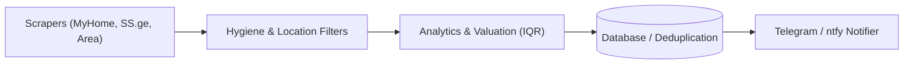

# Documentation standards — Diátaxis, docs-as-code, keep-fresh

The repo's docs are read by three audiences in this order:

1. **GitHub Markdown Renderer** — anyone browsing the repository sees rendered HTML. Optimise for clean rendering on GitHub first.
2. **AI coding assistants** — they read the markdown source, prompt contexts, and follow links from `GEMINI.md` / `README.md`.
3. **Humans cloning the repo** — browse with an editor preview (VS Code / Cursor) or CLI tools.

Every doc must work cleanly for all three.

Standards this skill follows:

- **[Diátaxis](https://diataxis.fr/)** — separate tutorials / how-to / reference / explanation; do not mix modes in one page.
- **Docs-as-code** — docs live in git alongside the code they describe, reviewed in the same commit / PR.
- **Single source of truth** — one canonical page per topic; everywhere else links. Never copy-paste living facts.

## Doc placement (single source of truth per topic)

Front door for humans: `docs/README.md` or root `README.md`.

| Kind | Location | Examples |
|---|---|---|
| **Guides** (how-to) | `docs/guides/` | `deployment.md`, `local-testing.md`, `telegram-setup.md`, `adding-scraper.md` |
| **Reference** (lookup) | `docs/reference/` | `tnet-api.md`, `filter-schemas.md`, `database-models.md`, `cloudflare-kv.md` |
| **Architecture** (explanation) | `docs/architecture/` | `scraping-pipeline.md`, `valuation-iqr.md`, `deduplication.md` |
| **Evergreen runbooks** | `docs/runbooks/` | `telegram-token-rotation.md`, `cloudflare-kv-sync.md` |
| **Historical** (one-time logs) | `docs/archive/` | dated migration / cutover notes |
| **ADRs** | `docs/adr/NNNN-slug.md` | Use `docs/adr/template.md`; index in `docs/adr/README.md` |
| **Repo entry points** | repo root | `README.md`, `GEMINI.md`, `.github/workflows/` |
| **Coding-agent skills** | `.agents/skills/<name>/SKILL.md` | Project-local AI skills (`tdd`, `sdd`, `git-commits`, etc.) |

### Naming and archival rules

- **Kebab-case filenames** for living docs under `docs/` (e.g. `scraping-pipeline.md`). ADR filenames keep `NNNN-short-slug.md`. Dated archive files keep `YYYY-MM-DD-slug.md`.
- **Historical material** belongs in `docs/archive/` with this banner near the top (after the H1 is fine):

  ```markdown
  > **Historical** — do not trust for current facts. Live scraper architecture
  > and filter configurations are documented in README.md and docs/reference/.
  ```

- **Never duplicate** living content — replace copies with a link to the canonical file.

## Living documentation — keep it correct after code changes

Docs drift when code or API contracts change and nobody updates the canonical page. Treat living docs as part of the change surface.

### When a code / config / ADR change MUST update docs

| Change surface | Update these (minimum) | Also consider |
|---|---|---|
| New or updated scraper portal (SS.ge, MyHome, Area) | `docs/reference/` portal doc, `README.md` | ADR status if introducing architectural shift |
| Search filters, hygiene rules, stop words | `docs/reference/filter-schemas.md`, `config/filters.json` | Filter test suites in `tests/` |
| Price analytics, valuation algorithms | `docs/architecture/valuation-iqr.md` | `README.md` feature summary |
| Database schema or sync mechanism (Cloudflare KV) | `docs/reference/database-models.md` | Runbooks under `docs/runbooks/` |
| Telegram notification templates or payload | `docs/guides/telegram-setup.md` | Notifier test fixtures |
| GitHub Actions schedule or workflow steps | `.github/workflows/scrape.yml`, `docs/guides/deployment.md` | `deploy-action` skill |
| New top-level skill under `.agents/skills/` | `.agents/skills/` index or repo README | Skill frontmatter and trigger descriptions |

## Diagrams: Mermaid, not ASCII art

GitHub renders Mermaid natively in fenced `mermaid` blocks:

````markdown

````

Cheat sheet: `flowchart LR` / `TD`, `sequenceDiagram`, `subgraph`, `<br/>` in labels, `[("store")]` for data, `(["User"])` for actors.

EXCEPTION: **directory trees** stay as ASCII in a plain fenced code block.

## Tables: blank line BEFORE the table

Markdown parsers require a blank line before any table. Use `<http://…>` angle-bracket auto-links inside tables.

## Markdown render hygiene (currency `$` + mid-token wraps)

Editor previews (Cursor / VS Code) and CommonMark flavours enable **dollar-math**: a pair of bare `$…$` on one line is parsed as LaTeX and mangles the text between them.
In a real estate repo, this happens constantly with price quotes: `$500 while the average was $750` renders as corrupted math.

**Rules:**

1. **Currency amounts stay in code spans.** Outside fenced code blocks, every `$` followed by a digit MUST sit inside backticks:
   write `` `$500` `` / `` `$750/mo` `` / `` `$120,000` ``, never bare `$500`. Prefer "USD 500" or "GEL 1500" in prose when a code span would clutter a sentence.
2. **Never hard-wrap mid-token.** Keep these on one physical line:
   - a full markdown link (do not break after the opening bracket or mid-label)
   - a full inline code span (do not break between the opening and closing backtick)
3. **Prefer logical paragraphs in living docs.** Soft-wrap at editor margins. Break only at spaces between tokens — never inside a dollar amount, an inline code span, or a markdown link.

```text
Bad  — bare $ pairs become math; link label split across lines:
  price dropped from $1200 to $900
  (see ADR
  0002)

Good — currency in code spans; link/label unbroken:
  price dropped from `$1200` to `$900`
  (see [ADR 0002](file:///docs/adr/0002-ss-ge-api.md))
```

## Skills format (for new project skills)

```markdown
---
name: <kebab-case-name>
description: Third-person "what + when". Include concrete trigger phrases
  the user would say. No "you" or "I". Max 1024 chars.
---

# Human title

[Body ≤ ~500 lines. Deep detail → references/ via progressive disclosure.]
```

Frontmatter `name` MUST match the folder name.

## Pre-commit checklist

1. Run all unit tests: `.\.venv\Scripts\python.exe -m unittest discover tests`.
2. Check relative markdown links resolve.
3. Ensure currency numbers use backticks: `` `$500` ``.
4. Verify no broken Mermaid syntax.
